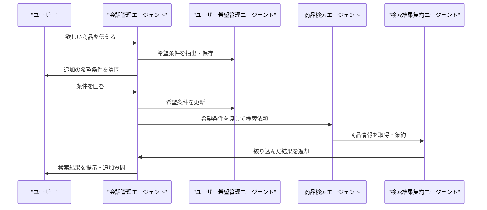

# お買い物エージェント 設計書

## 1. エージェント構成

本システムは、以下のエージェントで構成されます。

### 1.1 会話管理エージェント（Conversation Agent）
- ユーザーとの対話を主導し、希望条件のヒアリングや全体のフロー制御を担当
- 必要に応じて他のエージェントを呼び出す

### 1.2 ユーザー希望管理エージェント（User Preference Agent）
- 会話から抽出したユーザーの希望条件を整理・保持
- 希望条件の更新や追加、矛盾の解消

### 1.3 商品検索エージェント（Product Search Agent）
- ユーザーの希望条件をもとにWeb検索やAPI連携を実施
- 楽天、Amazon、その他販売サイトから商品情報を取得

### 1.4 検索結果集約エージェント（Result Aggregator Agent）
- 複数サイトから取得した商品情報を集約
- 希望条件に合致する商品を絞り込み、比較しやすい形でまとめる

---

## 2. エージェント間の役割分担

- 会話管理エージェントが全体の親エージェントとして振る舞い、他のエージェントを制御
- 各エージェントは独立した役割を持ち、疎結合で連携

---

## 3. 動作フロー（シーケンス図）

---

## 4. 各エージェントの詳細

### 4.1 会話管理エージェント
- ユーザーとの自然な対話を実現
- 希望条件のヒアリング、確認、追加質問の生成
- 他エージェントの呼び出し・連携

### 4.2 ユーザー希望管理エージェント
- ユーザーの希望条件（例：価格帯、色、機能など）を構造化して保持
- 条件の追加・修正・矛盾解消

### 4.3 商品検索エージェント
- 希望条件をもとにWeb検索やAPI連携を実施
- 商品情報（価格、機能、画像、URL等）を取得

### 4.4 検索結果集約エージェント
- 複数サイトからの情報を統合
- 希望条件に合致する商品を絞り込み、比較表やリスト形式でまとめる

---

## 5. 拡張性・保守性への配慮
- 各エージェントは独立しており、機能追加や修正が容易
- 新たな検索先や機能追加も、該当エージェントの拡張で対応可能 