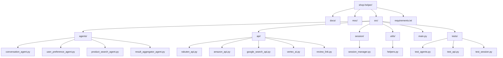

# 実装方針・ディレクトリ構成

## 1. 実装方針（ADK学習重視）

### 開発アプローチ
- **段階的学習**: ADKの学習を重視し、段階的に機能を実装
- **フロントエンド先行**: まずUIを完成させ、バックエンドはモックから開始
- **AI機能の段階的実装**: 基本AI → 買い物特化AI → 高度機能の順で実装

### 技術スタック
- **主要技術**：Python（バックエンド）、ADK（エージェント開発）、HTML/CSS/JS（フロントエンド）、Google Cloud Run（デプロイ）、Vertex AI（LLM/要約）
- **開発スタイル**：各エージェントを独立したクラス/モジュールとして実装し、会話管理エージェントが全体を制御
- **API連携**：楽天API、Amazon API、Google Custom Search API、Vertex AIは専用ラッパーモジュールで管理
- **データ管理**：セッションごとにメモリ上でデータを保持し、DBは利用しない
- **テスト**：各エージェント・APIラッパーのユニットテスト、主要フローの結合テストを実施

### 実装フェーズ
1. **Phase 1**: フロントエンド実装（UI完成）
2. **Phase 2**: バックエンド基盤（モックエージェント）
3. **Phase 3**: ADK学習・基本AI実装
4. **Phase 4**: 買い物アプリ特化（プロンプト最適化）
5. **Phase 5**: 高度な機能実装（お気に入り、口コミ等）
6. **Phase 6**: テスト・最適化
7. **Phase 7**: デプロイ・運用

## 2. ディレクトリ構成（案）

### 構成要点
- `src/agents/`：各エージェントの実装（会話管理、ユーザー希望、商品検索、集約）
- `src/api/`：外部API連携用ラッパー
- `src/session/`：セッション・データ管理
- `src/utils/`：共通ユーティリティ
- `src/main.py`：エントリーポイント
- `src/tests/`：ユニット・結合テスト
- `docs/`：設計・仕様書
- `moc/`：画面モック 

## 3. 実装順序（ADK学習重視）

### Phase 1: フロントエンド実装（1-2週間）
1. **基本的なUI構築**
   - HTML/CSS/JavaScriptの基本構造
   - レスポンシブデザインの実装
   - チャット画面の基本レイアウト
   - 商品一覧・詳細画面の実装

2. **インタラクション実装**
   - チャット機能の基本動作
   - メッセージ送信・受信の実装
   - 商品表示・選択機能
   - お気に入りボタンの実装

3. **UI/UX改善**
   - アニメーション・トランジション
   - ローディング表示
   - エラー表示
   - アクセシビリティ対応

### Phase 2: バックエンド基盤（1週間）
1. **FastAPI基盤構築**
   - 基本的なAPIエンドポイント
   - セッション管理の実装
   - エラーハンドリング

2. **モックエージェント実装**
   - 各エージェントの基本クラス構造
   - 固定返答を返すモック実装
   - エージェント間の連携基盤

### Phase 3: ADK学習・基本AI実装（2-3週間）
1. **ADK基盤学習**
   - ADKの基本概念理解
   - エージェント作成の学習
   - 基本的な会話機能の実装

2. **Vertex AI連携**
   - 基本的なAI機能の実装
   - 会話生成の実装
   - プロンプトエンジニアリングの学習

3. **会話機能の実装**
   - 自然な会話フローの実装
   - コンテキスト管理の実装
   - 基本的な商品推薦ロジック

### Phase 4: 買い物アプリ特化（2-3週間）
1. **プロンプト最適化**
   - 買い物特化のプロンプト設計
   - 商品検索・推薦ロジックの改善
   - ユーザー希望の理解精度向上

2. **商品検索機能実装**
   - 楽天API連携の実装
   - Amazon API連携の実装
   - Google Custom Search API連携
   - 検索結果の統合・最適化

3. **会話品質向上**
   - 商品知識の充実
   - 価格・機能比較の精度向上
   - ユーザー満足度の向上

### Phase 5: 高度な機能実装（2-3週間）
1. **お気に入り機能**
   - お気に入り登録・削除
   - お気に入り一覧表示
   - お気に入り商品の比較

2. **店舗比較機能**
   - 複数店舗の商品比較
   - 価格・送料・評価の比較
   - 比較結果の可視化

3. **口コミ検索・要約機能**
   - kakaku.com連携
   - Amazon口コミ取得
   - Vertex AIによる要約

### Phase 6: テスト・最適化（1-2週間）
1. **テスト実装**
   - ユニットテストの実装
   - 結合テストの実装
   - E2Eテストの実装

2. **パフォーマンス最適化**
   - レスポンス時間の改善
   - メモリ使用量の最適化
   - キャッシュ機能の実装

3. **セキュリティ強化**
   - セキュリティテストの実装
   - 脆弱性の修正
   - 監視機能の実装

### Phase 7: デプロイ・運用（1週間）
1. **本番環境構築**
   - Google Cloud Runの設定
   - ドメイン・SSL証明書の設定
   - 監視・ログ機能の実装

2. **運用開始**
   - 本番環境での動作確認
   - パフォーマンス監視
   - ユーザーフィードバック収集

## 4. 学習ポイント

### ADK学習の重点項目
1. **エージェント作成**: 基本的なエージェントの作成方法
2. **会話管理**: エージェント間の会話フロー制御
3. **プロンプト設計**: 効果的なプロンプトの作成方法
4. **コンテキスト管理**: 会話履歴の適切な管理
5. **エラーハンドリング**: エージェントの堅牢性向上

### 各フェーズでの学習目標
- **Phase 1**: UI/UX設計の理解
- **Phase 2**: API設計・バックエンド基盤の理解
- **Phase 3**: ADKの基本概念・エージェント作成の習得
- **Phase 4**: プロンプトエンジニアリング・AI特化の習得
- **Phase 5**: 高度な機能実装・システム統合の理解
- **Phase 6**: テスト・品質保証の実践
- **Phase 7**: デプロイ・運用の実践

## 5. マイルストーン

### 短期目標（1ヶ月）
- [ ] フロントエンド完成
- [ ] バックエンド基盤完成
- [ ] 基本的なADKエージェント実装

### 中期目標（2-3ヶ月）
- [ ] 買い物特化AIの実装
- [ ] 商品検索機能の完成
- [ ] お気に入り・店舗比較機能の実装

### 長期目標（4-6ヶ月）
- [ ] 口コミ機能の実装
- [ ] テスト・最適化の完了
- [ ] 本番環境での運用開始 